# Microservicios-Spring-Boot-Hello-World

En esta guía encontrará el paso a paso y las herramientas para desarrollar una aplicación basada en arquitectura de microservicios, usando springboot para el backend y react para el frontend. Adicionalmente, se encuentran los pasos para desplegarla en un clúster de RedHat Openshift.

### Contenido

1. [Pre-requisitos](#pre-requisitos)
2. [Aplicación a desarrollar](#aplicación-a-desarrollar)
    1. [¿Cómo ejecutar la aplicación?](#¿cómo-ejecutar-la-aplicación)
3. [Desarrollo del backend](#desarrollo-del-backend)
    1. [Creación del microservicio](#creación-del-microservicio)
    2. [Desarrollo del backend](#desarrollo-del-backend)
    3. [Pruebas de las llamadas API usando Postman](#pruebas-de-las-llamadas-api-usando-postman)
4. [Desarrollo del frontend](#desarrollo-del-frontend)

5. [Despliegue de la aplicación](#despliegue-de-la-aplicación)

6. [Referencias](#referencias)
6. [Autores](#autores)

## Pre-requisitos

- [NodeJS](https://nodejs.org/es)
- [Visual Studio Code](https://code.visualstudio.com/)
- [Git](https://git-scm.com/downloads)
- [React Developer Tools](https://react.dev/learn/react-developer-tools)
- [SpringBoot Extension Pack](https://marketplace.visualstudio.com/items?itemName=vmware.vscode-boot-dev-pack)
- [Java Extension Pack](https://marketplace.visualstudio.com/items?itemName=vscjava.vscode-java-pack)
- [Postman](https://www.postman.com/downloads/)
- [Clonar el repositorio alterno](https://github.com/sofiaponteb/Microservicios-Spring-Boot-Dev-HelloWorld-Workshop)  de forma local, para tener acceso al código del Workshop

## Aplicación a desarrollar
La aplicación presentada en esta guía contiene dos microservicios, los cuales reciben llamadas API que modifican o leen una variable de texto, estas variables son mostradas en un frontend a modo de chat. 
</br>
</br>
La arquitectura de la aplicación es la siguiente:
<p align="center">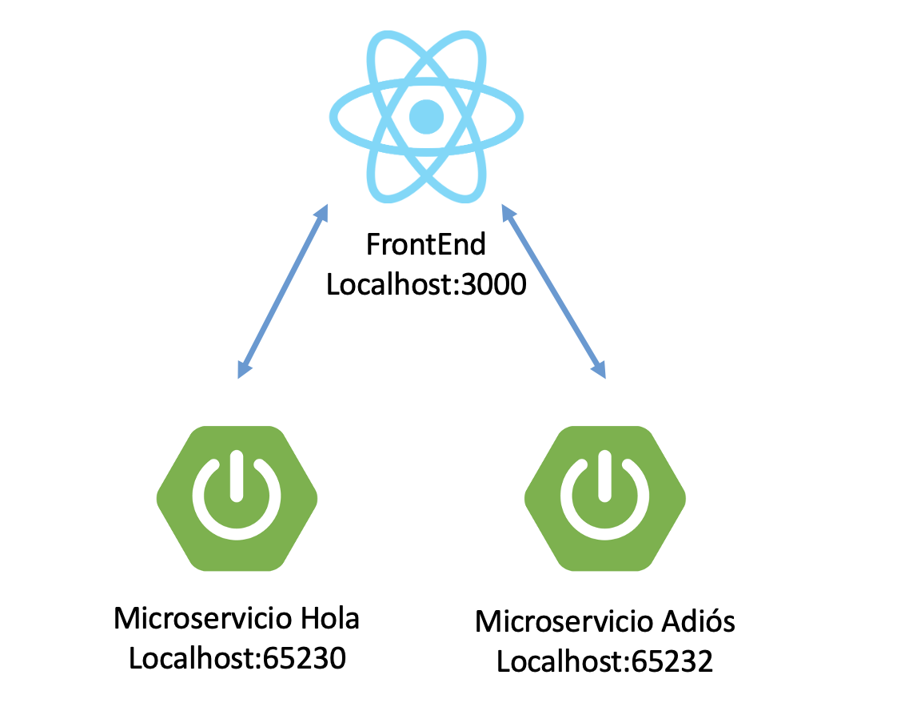</p>
</br>
La interfaz de la aplicación se presenta a continuación:
<p align="center">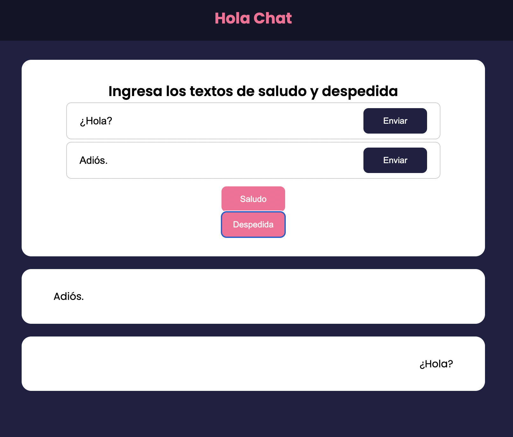</p>
Los botones de la parte superior permiten hacer llamadas del tipo API POST al backend, permitiendo modificar los valores de las variables. De un modo similar, los botones inferiores permiten hacer llamadas del tipo API GET al backend, para así poder obtener el valor actual de la variable.

### ¿Cómo ejecutar la aplicación?

1. Ingrese a VS code y abre la carpeta que contiene este repositorio

2. En el menú de la izquierda elija la vista de explorador de archivos. Seleccione:
```
backend > hello_service > src > main > java
```

3. Abra el archivo ```HelloServiceApplication.java```

4. Luego de que abra este archivo, automáticamente le aparecerá un nuevo ítem en el menú de la izquierda, con el logo de SpringBoot. Dé click en este ícono:
<p align="center">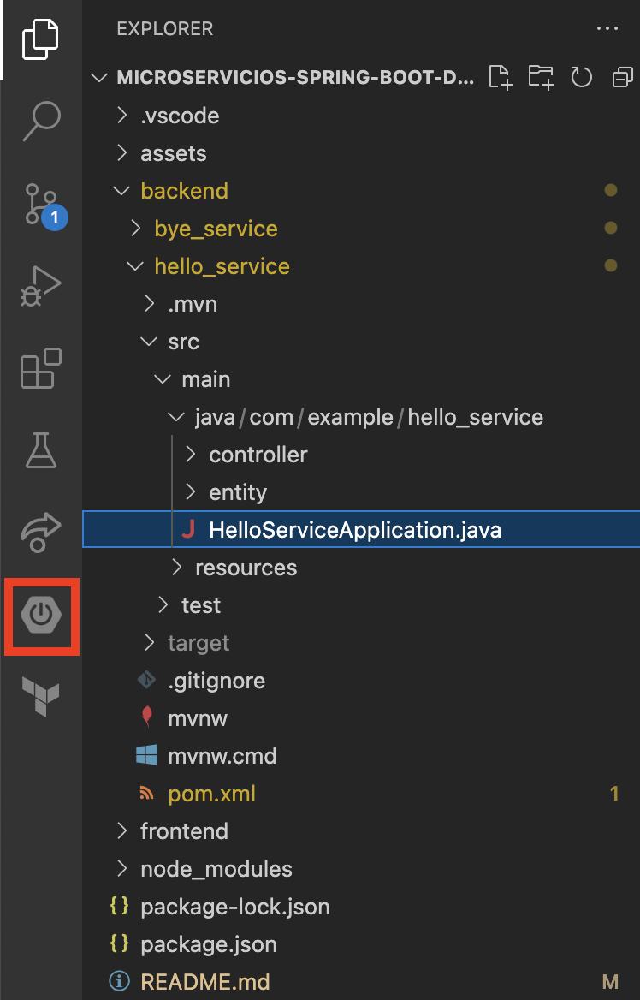</p>

5. En la parte de arriba le aparecerán los dos microservicios de la apliación. Dé click en el botón de play al lado de cada uno:
<p align="center">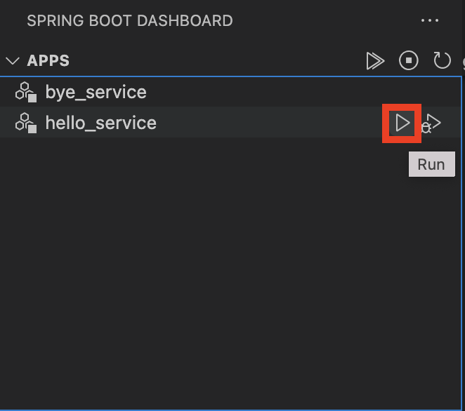</p>

6. Solo falta iniciar el frontEnd. Para esto, ingrese a la terminal de su equipo, y abra la carpeta que contiene los archivos del repositorio. Allí ingrese a la carpeta frontend:

```
cd frontend
```

7. Deberá descargar las dependencias de node necesarias para ejecutar el frontend. Este comando lo hará de forma automática:

```
npm install
```

8. Para ejecutar la aplicación utilice el comando

```
npm start
```

9. El comando anterior debería abrir automáticamente la app en una página en el navegador. Sin embargo, si eso no sucede, ingrese a su navegador y en la barra de direcciones ponga la siguiente dirección:

```
http://localhost:3000/
```

## Desarrollo del BackEnd

En el repositorio alterno [
Microservicios-Spring-Boot-Dev-HelloWorld-Workshop](https://github.com/sofiaponteb/Microservicios-Spring-Boot-Dev-HelloWorld-Workshop), actualmente solo hay un microservicio. En esta guía se incluirá el código del servicio **bye_service**

### Creación del microservicio

1. Abra la carpeta del repositorio alterno en VS code. En la sección de backend le aparecerá solo el microservicio **hello_service**

<p align="center">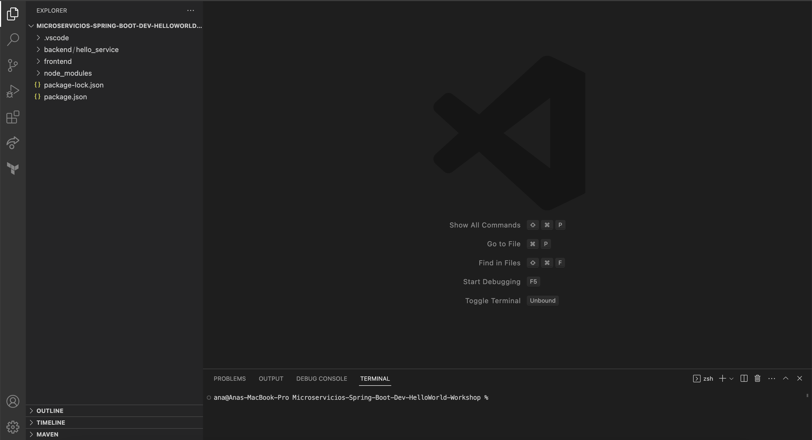</p>

2. Dé click en ```ctrl+shift+P``` y escriba **java jdk** Abra la opción que aparece para instalar el JDK.

<p align="center">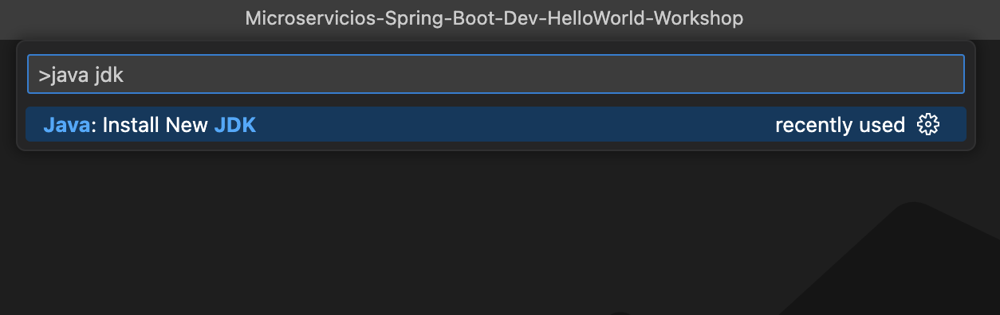</p>

3. Seleccione la opción **17** y dé click en **Download**

<p align="center">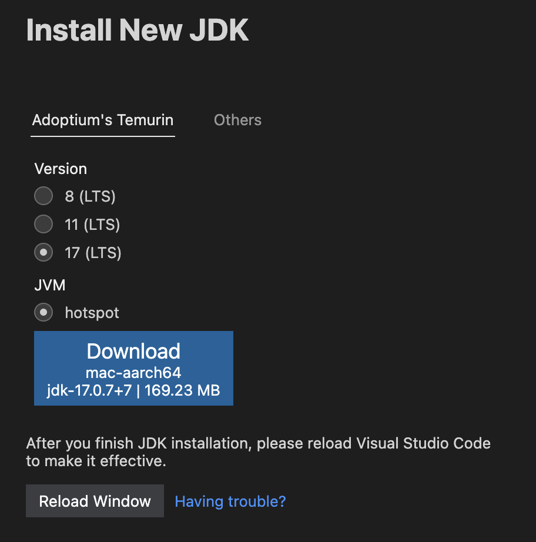</p>

4. Cuando se termine la descarga del JDK, abra el archivo y siga las instrucciones de instalación.

<p align="center">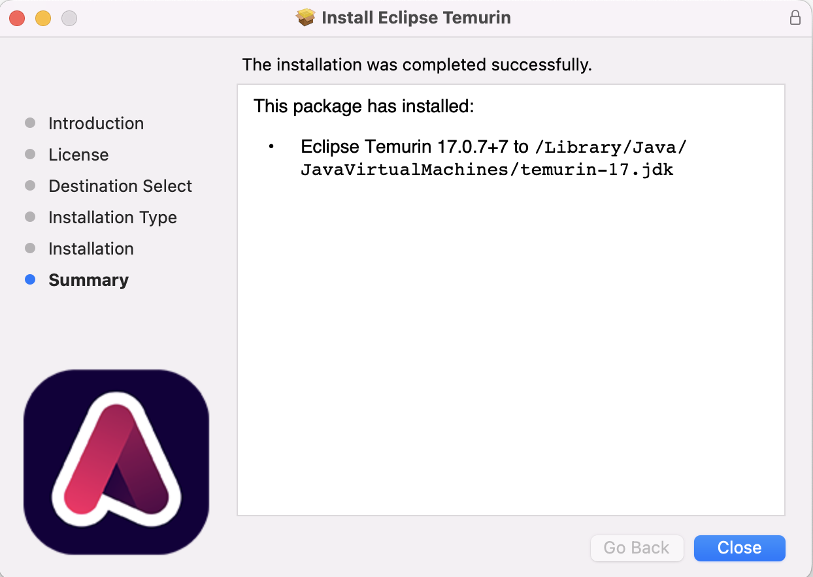</p>

5. Ahora se creará el proyecto. Para ello dé click en ```ctrl+shift+P``` y escriba **spring init**. Seleccione la opción **Create a Maven Project**

<p align="center">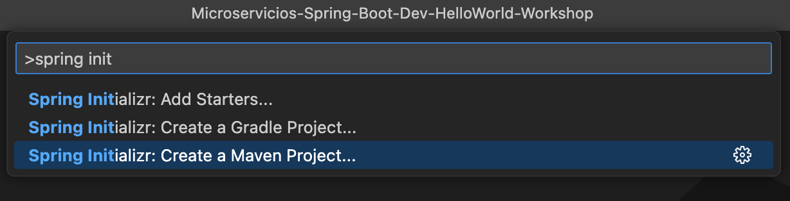</p>

6. seleccione una versión que no sea snapshot. En este caso se seleccionó **3.0.6**

<p align="center">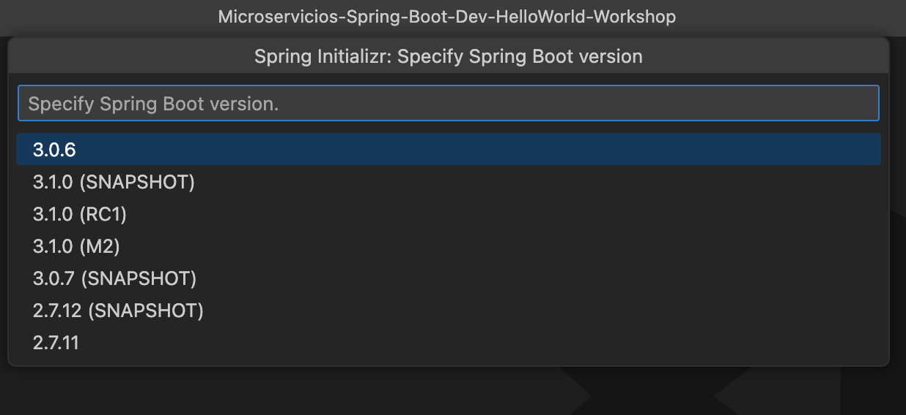</p>

7. Seleccione el lenguaje de programación **Java**

<p align="center">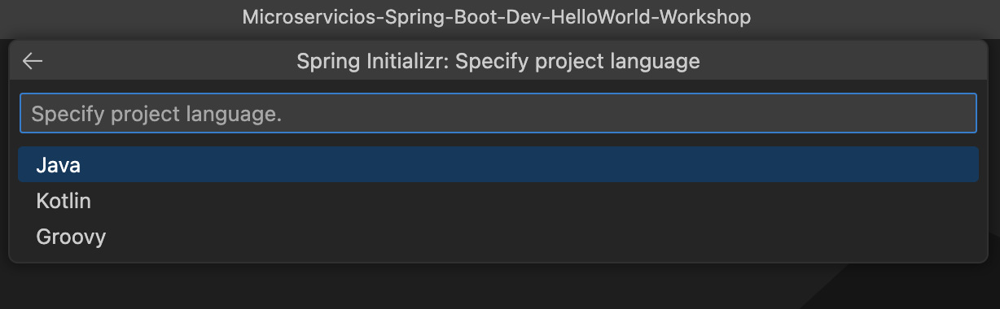</p>

8. Deje el input group id por defecto: **com.example**

<p align="center">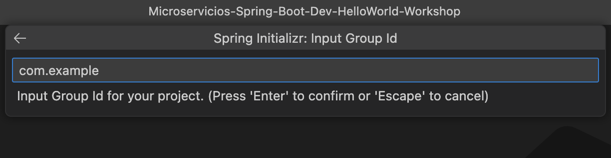</p>

9. Escriba el nombre del microservicio: **bye_service**

<p align="center">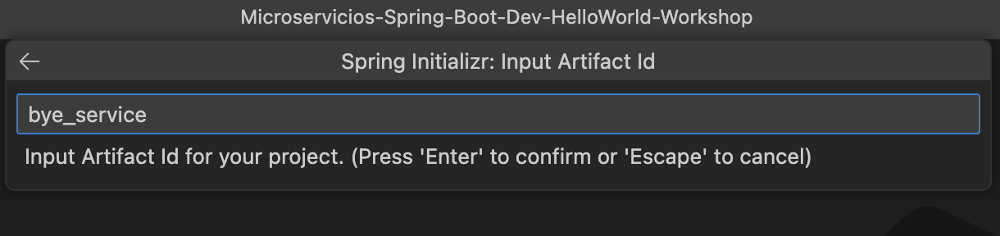</p>

10. Seleccione la extensión **jar**

<p align="center">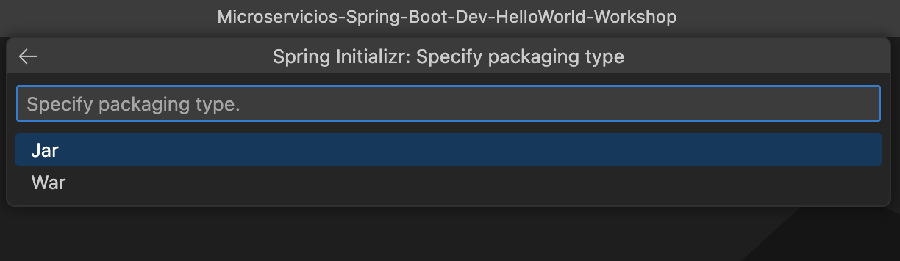</p>

11. Seleccione la versión de java **17**

<p align="center">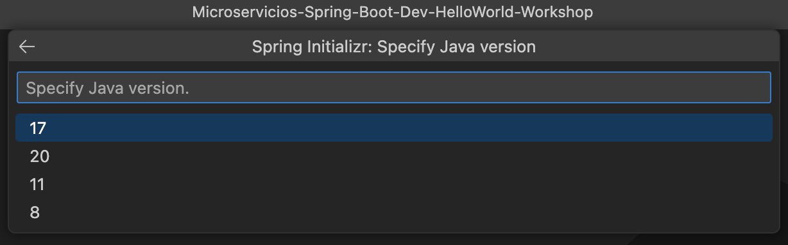</p>

12. Para las dependencias escriba **Spring Web** y selecciónela. Adicionalmente, escriba **springboot devtools** y seleccione la dependencia que se muestra en la imagen.

<p align="center">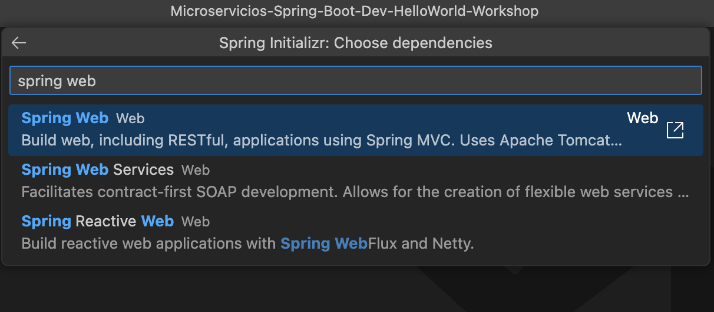</p>

<p align="center">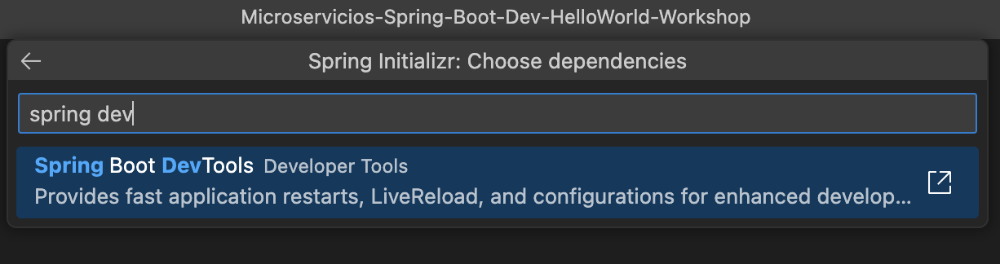</p>

13. Finalmente, seleccione la carpeta backend y dé click en **Generate into this folder**

<p align="center">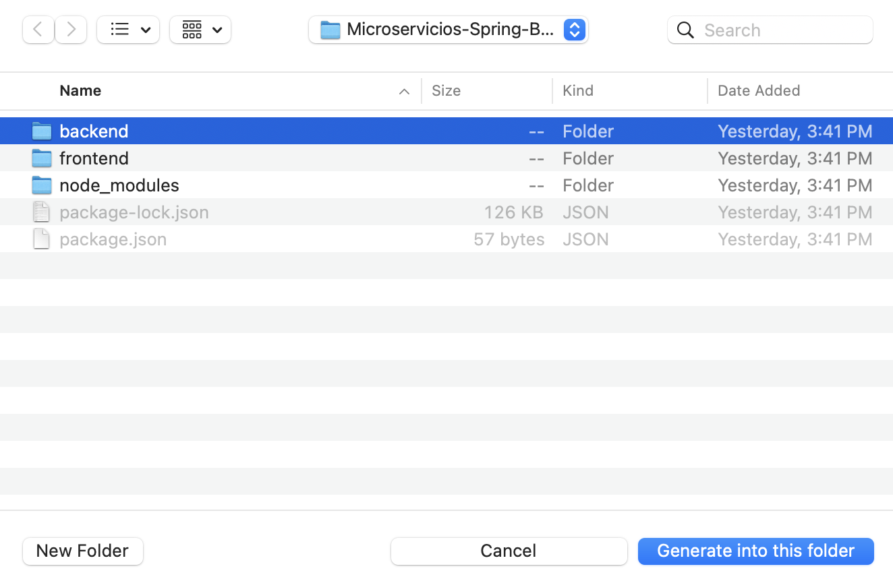</p>

14. Para verificar la correcta creación del microservicio, abra el archivo ```ByeServiceApplication.java``` ubicado en la ruta ``` backend > bye_service > src > main > java``` . Ingrese a la extensión de springboot en la sección izquierda de su pantalla y dé play al microservicio. Le deberá aparecer una terminal como la que se muestra a continuación:

<p align="center">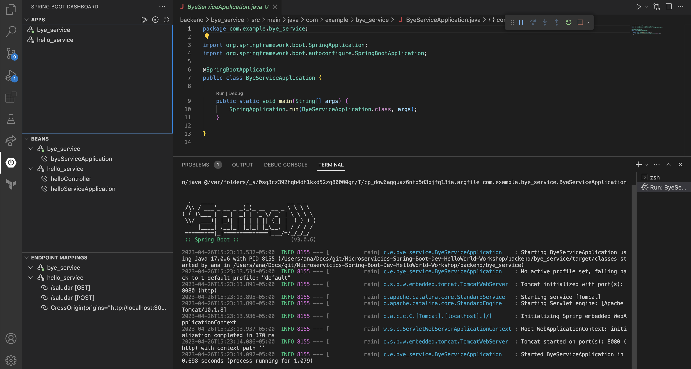</p>

### Desarrollo del microservicio

1. Inicialmente, es necesario incluir una dependencia que permitirá al frontEnd hacer llamadas API al microservicio. Para ello, abra el archivo ```pom.xml``` ubicado en la carpeta ```bye_service```. 

Al final de la línea 35, que corresponde al final de una dependencia ```</dependency>```, presione enter e inserte el siguiente código de dependencia:

```
<dependency>
			<groupId>org.apache.httpcomponents</groupId>
			<artifactId>httpclient</artifactId>
			<scope>test</scope>
</dependency>
```

2. Ahora se realizará la configuración de nombre y puerto. Abra el archivo ```application.properties``` ubicado en la ruta ```backend > bye_service > src > main > resources```. Inserte el siguiente fragmento de código para asignarle nombre y puerto al microservicio:
```
spring.application.name=microservicio-bye
server.port=65232
```

3. En nuestro microservicio solo tendremos una variable, llamada **Despedida**. Vamos a crear la clase **ByeEntity** donde se almacenará dicha variable. En el menú de la izquierda, despliegue la sección **JAVA POJECTS** y diríjase a la ruta ```bye_service > src > main > java > com > example > bye_service``` y cree un paquete ```entity```, dentro de este paquete cree una clase llamada ```ByeEntity```.


En esta clase se creará la variable de tipo string llamada **Despedida**, donde se almacenará el texto ingresado en la página web. Asímismo, se crea el get y el set correspondiente a esta variable. Ingrese el siguiente código en su archivo ```ByeEntity.java```, dentro de la clase **ByeEntity**:

```
    private String Despedida;

    public void set_Despedida(String newDespedida){
        this.Despedida = newDespedida;
    }

    public String get_Despedida(){
        return this.Despedida;
    }
```

4. Finalmente, crearemos la clase **ByeController**, que se encargará de recibir las llamadas API. Diríjase a la ruta ```backend > bye_service > src > main > java > com > example > bye_service``` y cree un paquete ```controllers```, dentro de este paquete cree un archivo llamado ```ByeController```.

- Al principio del archivo, debajo de la llamada al paquete **com.example.bye_service.controller**, inserte el siguiente código, que importa todos los elementos necesarios para manejar llamadas API, tener acceso a la variable creada, y poder establecer conexión con el frontend:

```
import org.springframework.http.HttpStatus;
import org.springframework.web.bind.annotation.GetMapping;
import org.springframework.web.bind.annotation.PostMapping;
import org.springframework.web.bind.annotation.RequestMapping;
import org.springframework.web.bind.annotation.RequestParam;
import org.springframework.web.bind.annotation.ResponseBody;
import org.springframework.web.bind.annotation.RestController;

import com.example.bye_service.entity.ByeEntity;

import org.springframework.web.bind.annotation.CrossOrigin;
```

- Ahora deberá incluir las anotaciones para el controlador y la extensión de las llamadas API. En la línea inmediatamente superior a la declaración de la clase:

```
@RestController
@RequestMapping("/adios")
```

- Luego de la declaración de la clase incluya este código, el cual crea la variable agente que recibirá las llamadas API, y permite recibir llamadas API desde el puerto 3000, que corresponde al frontend.

```
    private ByeEntity Agente = new ByeEntity();

    @CrossOrigin(origins = "http://localhost:3000")
```

- Ahora se incluye el mapeo de las llamadas API GET. Cuando se hacen estas llamadas se debe entregar el valor del string Despedida:

```
    @GetMapping()
    public String Despedida(){
        return Agente.get_Despedida();
    }
```

- Finalmente, se incluye el mapeo de las llamadas API POST. Cuando se hacen estas llamadas se debe recibir un valor nuevo para el string Despedida, y modificar dicha variable:

```
    @PostMapping()
    @ResponseBody
    public HttpStatus setDespedida(@RequestParam(defaultValue = "Adios!") String Despedida){
        Agente.set_Despedida(Despedida);
        return HttpStatus.OK;
    }
```

### Pruebas de las llamadas API usando Postman
Para verificar el adecuado funcionamiento de las APIs creadas, se puede usar el software [postman](https://www.postman.com/downloads/). Antes de iniciar esta serie de pasos, asegúrese de haber ejecutado cada microservicio en VS code, como se indica en la sección [¿Cómo ejecutar la aplicación?](#¿cómo-ejecutar-la-aplicación).

1. Ingrese a la aplicación postman y seleccione **Create new collection** en la esquina superior izquierda

<p align="center">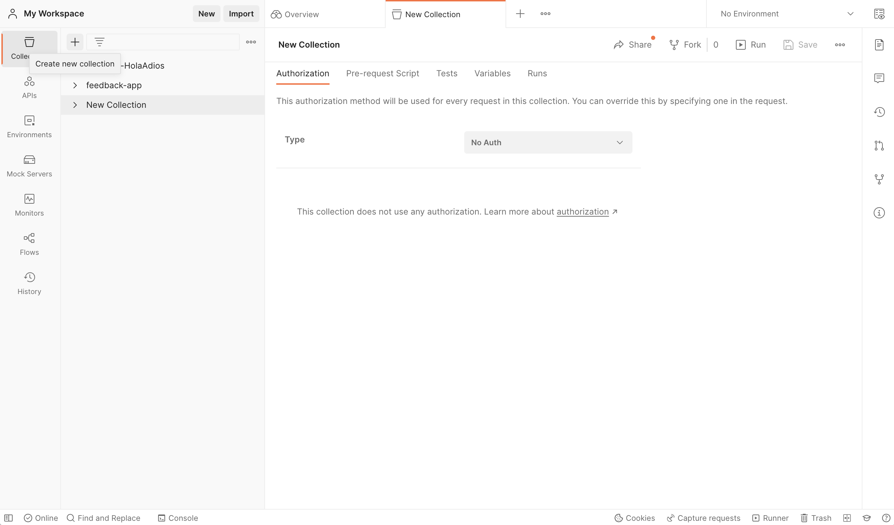</p>

2. Aparecerá su nueva colección en el menú de la izquierda, al lado del nombre de su nueva colección seleccione los 3 puntos y dé click en **Add Request**

<p align="center">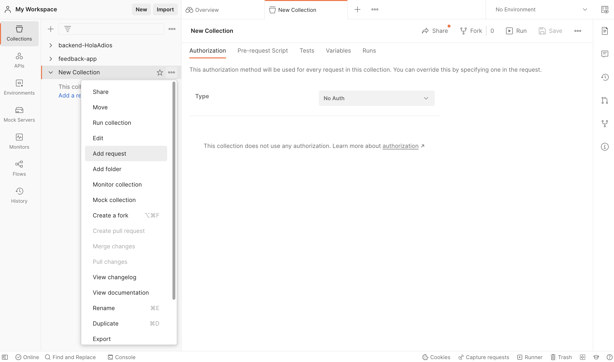</p>

3. En la parte superior seleccione **GET**, en la barra de direcciones escriba la siguiente URL:
```http://localhost:65230/saludar```
A continuación, repita los pasos 2 y 3, pero esta vez creando un request **POST**

<p align="center">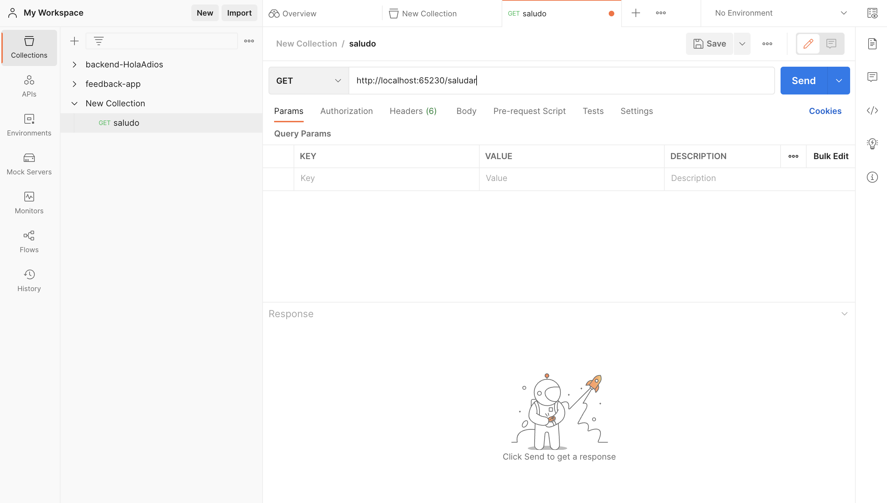</p>

4. Para probar el funcionamiento de las llamadas **POST** al microservicio de saludo, ingrese al request y seleccione la pestaña **Body**, diligencie los campos de la tabla:
- KEY: Saludo
- VALUE: "Este es un test de saludo"

Dé click en el botón **Send**, si el request se completa de manera correcta aparecerá el mensaje OK en la terminal.

<p align="center">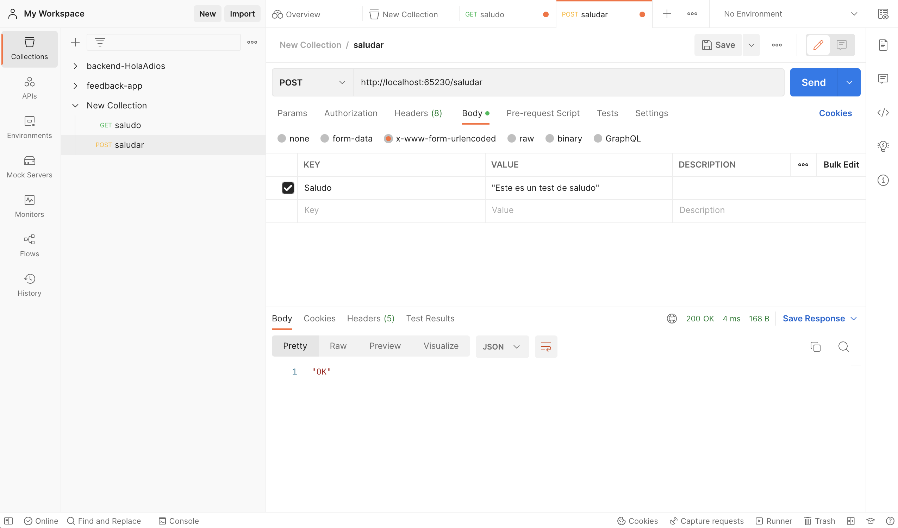</p>

5. Para probar el funcionamiento de las llamadas **GET** al microservicio de saludo, ingrese al request y dé click en el botón **Send**. Si el request se completa de manera correcta, en la terminal aparecerá el texto que incluyó en el post que realizó en el paso anterior.

<p align="center">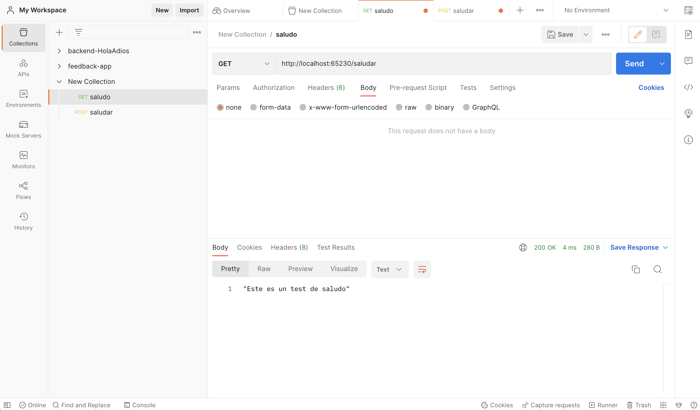</p>

6. Para probar el microervicio de despedida, se realiza de la misma forma, dé click en los 3 puntos al lado del nombre de su colección y seleccione **Add request**. En la parte superior seleccione **GET**, en la barra de direcciones escriba la siguiente URL:
```http://localhost:65232/adios```

Repita este paso con un request de tipo **POST**

7. Para probar el funcionamiento de las llamadas **POST** al microservicio de despedida, ingrese al request y seleccione la pestaña **Body**, diligencie los campos de la tabla:
- KEY: Despedida
- VALUE: "Chao"

Dé click en el botón **Send**, si el request se completa de manera correcta aparecerá el mensaje OK en la terminal.

8. Para probar el funcionamiento de las llamadas **GET** al microservicio de despedida, ingrese al request y dé click en el botón **Send**. Si el request se completa de manera correcta, en la terminal aparecerá el texto que incluyó en el post que realizó en el paso anterior.

## Desarrollo del FrontEnd


## Despliegue de la Aplicación


## Referencias

- [Creación de un proyecto con SpringBoot](https://www.youtube.com/watch?v=BSLCmMDxWzg)
- [Creación de un proyecto con React](https://ibm-learning.udemy.com/course/react-front-to-back-2022/learn/lecture/29767686#overview)

## Autores
Equipo *IBM Cloud Tech Sales Colombia*
